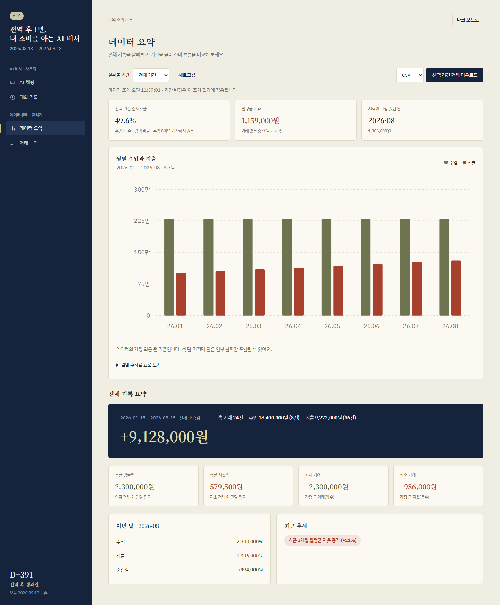
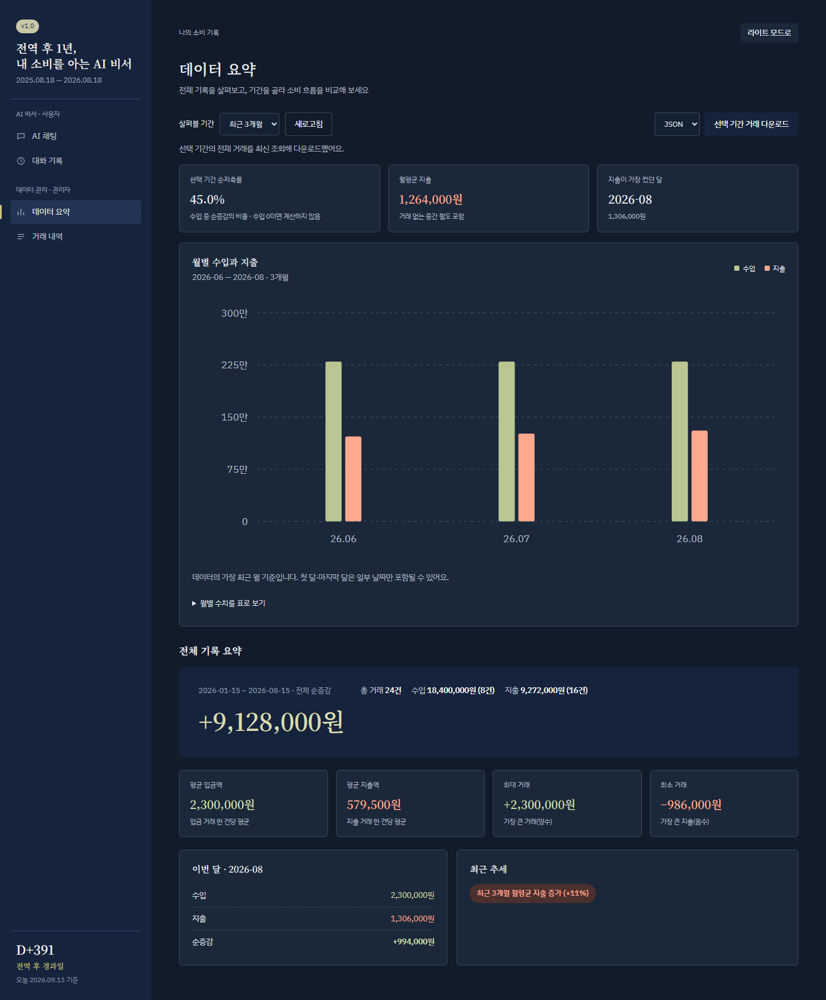
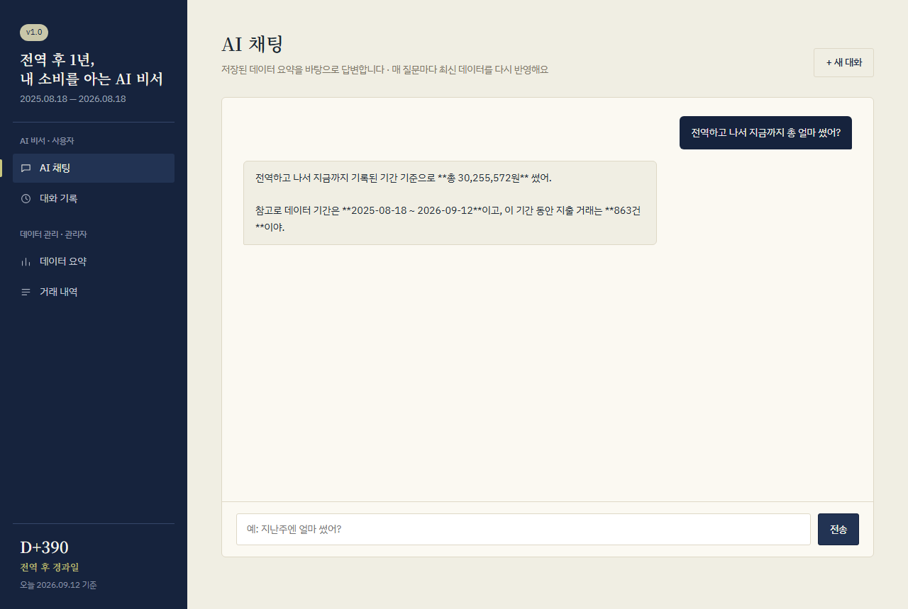
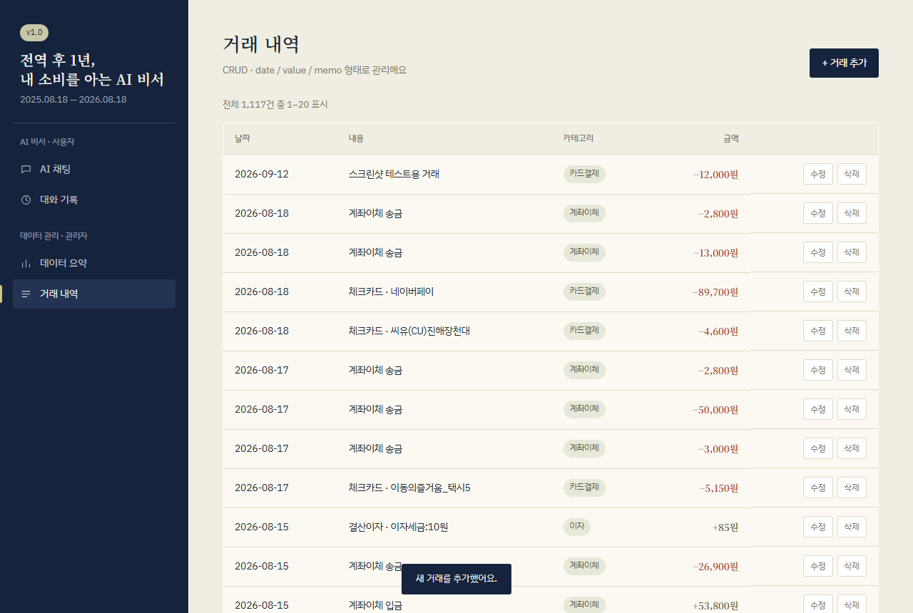
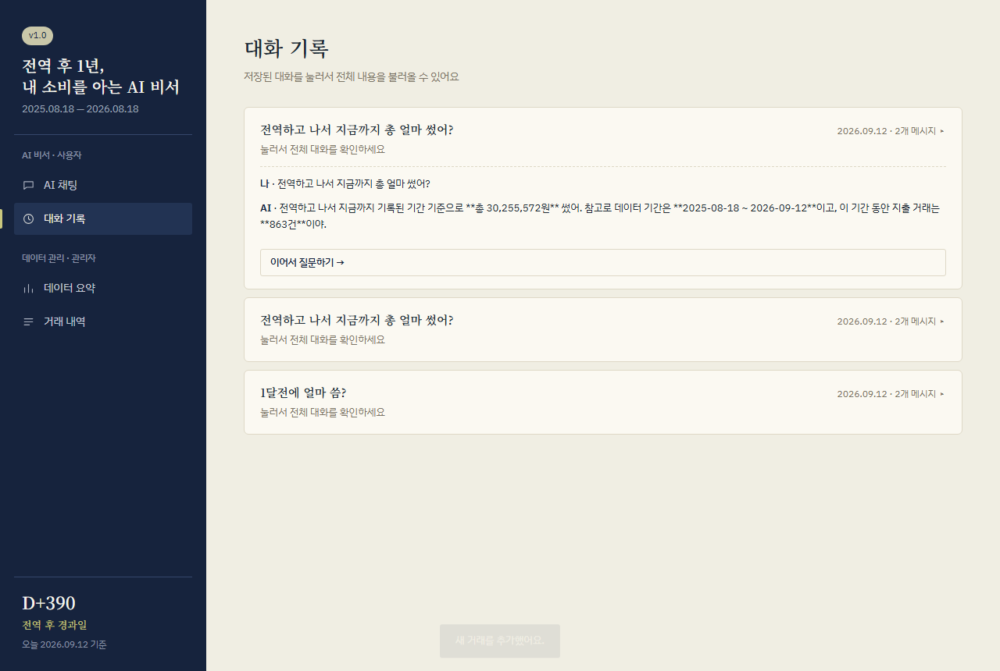

# 전역 후 1년, 내 소비를 아는 AI 비서

비식별화한 KB국민은행 거래내역으로 수입·지출·저축 패턴을 살펴보고 질문하는 개인용
AI 비서입니다. 원본 기준 기간은 2025.08.18~2026.08.18, 거래는 1,116건입니다.
추가·수정·삭제 후의 통계는 현재 데이터에서 다시 계산합니다.

## 주요 기능

- AI 채팅: 최신 전체·월별 요약을 시스템 프롬프트에 넣어 답변하고 대화를 자동 저장
- 거래 관리: 목록·페이지 이동·추가·수정·삭제, 미분류와 사용자 정의 분류 보존
- 대화 기록: 목록 조회·전체 불러오기·이어서 질문하기, 별도 저장·삭제 API
- 전체 요약: 수입·지출·순증감·평균·최대/최소 거래·최근 추세
- **선택 보너스 — 인사이트·UX 고도화**: 월별 그래프·추가 지표·기간 선택·CSV/JSON·다크 모드

기존 Function Calling·MCP 보너스는 제거했습니다. 기본 AI는 도구 호출 없이 컨텍스트
주입 방식으로 동작합니다. 제공된 집계에 없는 가맹점·개별 거래 정보는 추측하지 않도록
안내합니다. AI 답변의 정확성은 실제 배포에서 별도로 검증해야 합니다.

## 기술 스택

| 영역 | 구성 |
|---|---|
| 백엔드 | Python 3.10 이상, FastAPI, Pydantic, uvicorn |
| DB | Firebase Firestore, 서버의 Admin SDK |
| AI | OpenAI 호환 코디세이 프록시, gpt-5.5 |
| 프론트 | HTML/CSS/Vanilla JavaScript, SVG 그래프, 외부 그래프 라이브러리 없음 |
| 배포 | Render 백엔드, Vercel 정적 프론트 |
| 배포 설정 생성 | Node.js 기본 모듈로 API 주소 생성·정적 파일 복사, 프레임워크 없음 |

## 배포 주소와 현재 검증 범위

- [프론트](https://my-ai-assistant-weld.vercel.app)
- [백엔드](https://my-ai-assistant-bogq.onrender.com)
- [Swagger](https://my-ai-assistant-bogq.onrender.com/docs)

위 주소는 기존 배포입니다. **이번 UX 보너스 변경은 로컬 구현·검증 완료, 미커밋·미배포**
상태입니다. 실제 Firestore·코디세이 AI·배포 URL 통합 검증까지 끝났다는 뜻이 아닙니다.
Render 무료 서비스는 첫 요청이 지연될 수 있어 전역 대기 안내를 표시합니다.

## 로컬 실행

백엔드(PowerShell):

```powershell
cd backend
python -m venv venv
.\venv\Scripts\Activate.ps1
pip install -r requirements.txt
# .env.example을 참고해 backend/.env에 실제 값을 입력
uvicorn main:app --reload
```

[로컬 Swagger](http://localhost:8000/docs)에서 API를 확인합니다.
프론트는 `frontend/js/config.js`의 공개 주소를 로컬 백엔드 주소로 바꾼 뒤 실행합니다.

```powershell
cd frontend
python -m http.server 5500
```

[로컬 프론트](http://localhost:5500)에서 열고, 백엔드의 ALLOWED_ORIGINS에
`http://localhost:5500`을 포함합니다. 페이지를 파일 더블클릭으로 열지 않습니다.

## 환경변수

백엔드의 `backend/.env` 또는 Render 설정에 입력합니다.

| 변수 | 내용 |
|---|---|
| OPENAI_API_KEY | 코디세이 프록시 키, Git에 저장하지 않음 |
| OPENAI_BASE_URL | https://copa.codyssey.kr/v1 |
| OPENAI_MODEL | gpt-5.5 |
| FIREBASE_SERVICE_ACCOUNT_JSON | 서비스 계정 JSON의 내용. 경로가 아닌 JSON 문자열 |
| ALLOWED_ORIGINS | 배포 시 https://my-ai-assistant-weld.vercel.app, 복수 주소는 쉼표로 구분 |

기존 MCP_SHARED_SECRET·MCP_ALLOWED_HOSTS는 더 이상 사용하지 않습니다.
Render의 기존 값이나 Claude 커넥터는 코드 변경만으로 삭제되지 않으므로 계정에서 정리합니다.

프론트 Vercel 환경변수:

| 변수 | 값 |
|---|---|
| API_BASE_URL | https://my-ai-assistant-bogq.onrender.com |

`frontend/build.mjs`가 이 값만 `dist/js/config.js`로 생성합니다. **공개 주소용이며 비밀키를
넣지 않습니다.** 빌드 시 값이 없거나 HTTP(S) 주소가 아니면 실패합니다. Vercel에서는 HTTPS만
허용합니다. 환경변수 변경은 새 배포부터 반영됩니다.

## 배포 설정

| 서비스 | 설정 |
|---|---|
| Render | Root: backend / Build: pip install -r requirements.txt |
| Render | Start: uvicorn main:app --host 0.0.0.0 --port $PORT |
| Vercel | Root: frontend / Framework: Other |
| Vercel | Build: node build.mjs / Output: dist (`vercel.json`에 포함) |

Vercel의 기존 빈 Build Command·Output override가 있다면 위 설정과 맞춥니다.
API_BASE_URL을 Production과 필요한 Preview 환경에 각각 등록한 후 재배포합니다.
로컬에서 같은 산출물을 확인하려면:

```powershell
cd frontend
$env:API_BASE_URL = "http://localhost:8000"
node build.mjs
python -m http.server 5500 --directory dist
```

설정 방식은 [Vercel 빌드 안내](https://vercel.com/docs/builds/configure-a-build)와
[환경변수 안내](https://vercel.com/docs/environment-variables)를 따릅니다.

## 보너스 사용 방법과 계산 규칙

1. 데이터 요약에서 **전체 / 최근 6개월 / 최근 3개월**을 선택합니다.
2. 선택 기간의 순저축률·월평균 지출·최대 지출 월과 월별 수입·지출 그래프를 확인합니다.
   그래프 아래에서 같은 수치를 표로도 볼 수 있습니다. 모바일 그래프는 좌우로 이동합니다.
3. CSV 또는 JSON을 골라 **선택 기간 거래 다운로드**를 누릅니다.
4. 우측 상단에서 다크 모드를 전환합니다. 선택은 다음 방문에도 유지됩니다.

기간은 오늘이 아닌 **데이터 최신월**을 기준으로 합니다. 조회한 summary의 기간 선택은
추가 DB 요청 없이 화면에서 적용하며, 새로고침·화면 재진입은 최신 데이터를 조회합니다.
다운로드는 클릭 시 최신 데이터에서 해당 기간의 **모든 거래**를 조회합니다. 따라서 다른
곳에서 거래를 변경했다면 화면에 표시된 조회 시점과 다운로드 결과가 다를 수 있습니다.

- 수입: 양수 합계 / 지출: 음수 절댓값 합계 / 순증감: 수입 − 지출
- 순저축률: 순증감 ÷ 수입 × 100. 소수 1자리, 수입 0이면 계산 불가(null). 투자 수익률 아님
- 월평균 지출: 선택 기간 지출 ÷ 월 수. 거래 없는 중간 월도 0원으로 포함
- 최대 지출 월: 지출이 가장 큰 월. 동률이면 먼저 나온 월, 지출 없으면 표시하지 않음
- 첫 달·마지막 달은 부분 월일 수 있으므로 달 전체 실적처럼 해석하지 않음

summary에 `monthly`, `insights`, `generated_at`이 추가되고 기존 응답 필드는 유지됩니다.
`GET /api/data/export?format=csv&months=3` 또는 `format=json&months=all`로 내보냅니다.
CSV는 UTF-8 BOM으로 한글을 지원하고 텍스트 수식 실행을 방지합니다. JSON은 타입·null을
보존합니다. 필드는 id/date/value/memo/category이며 원본 엑셀·비밀키는 포함하지 않습니다.

## 데이터 흐름

```text
거래 CRUD → Firestore data
                  ↓ 요청당 전체 조회 1회
         기본 통계 + 월별 통계 + 인사이트
              ↙                     ↘
      그래프·기간 선택          시스템 프롬프트 + 질문
                                      ↓
                                코디세이 GPT
                                      ↓
                              대화 자동 저장 → 답변
```

AI는 1200 토큰 예산을 사용합니다. 빈 length 응답이면 2400으로 한 번만 재시도하고,
계속 비어 있으면 안내 문구를 반환합니다. 이 완화책이 reasoning 문제의 해결 완료를 뜻하지는
않습니다. 채팅 저장 실패는 한 번 재시도한 뒤 실패 응답을 반환합니다.

## 개인정보·운영 범위

- 원본 엑셀·계정 키·.env·로그는 Git에 넣지 않습니다. 이미 비식별화된 거래만 사용합니다.
- 이름을 숨긴다는 이유로 거래를 삭제하지 않습니다. 실제 데이터 정리·재적재는 별도 작업입니다.
- 내보내기는 DB의 memo를 그대로 사용합니다. 민감한 내용을 새 거래에 입력하지 않습니다.
- 현재 개인 과제용 API에는 사용자 인증이 없습니다. CORS는 인증이 아니므로 공개 주소를
  아는 외부 요청도 API에 접근할 수 있습니다. 별도 접근 보호 없이 실제 민감 자료를 추가하면 안 됩니다.
- 요청 간 캐싱은 없으므로 1,116건 기준 전체 조회 45회면 50,000 읽기를 넘습니다. 여러 번의
  실데이터 검증은 쿼터를 소모합니다. 이번 검증은 합성 데이터와 가짜 AI 응답을 사용했습니다.

## 확인한 것과 남은 것

로컬: 기본 CRUD·요약·대화 저장/불러오기, 0건·수입 0·거래 없는 월, CSV/JSON 기간·형식,
CSV 수식 방지, 그래프·표·기간 전환, 다크 모드 유지, 모바일 가로 넘침 없음,
화면 오류·빈 데이터 처리, JavaScript 오류 0건을 확인했습니다. 외부 서비스 연결은 대체한
검증이므로 실제 Firestore 권한·데이터·코디세이 응답·CORS 배포 설정은 재배포 후 확인합니다.

## 화면 예시

아래 신규 캡처는 **로컬 합성 데이터·가짜 AI 응답**으로 UI를 확인한 자료입니다.
실제 1,116건 통계 또는 현재 배포 성공의 증거가 아닙니다.




기존 배포 당시 핵심 기능 캡처(현재 변경 전 화면):





제출 전에는 새 버전을 실제 배포하고 질문+답변+요약, 거래 관리, 대화 불러오기를 다시
촬영합니다. 상세 요구사항·작업 기록은 [PRD](docs/PRD.md), [Task](docs/Task.md)에 있습니다.
